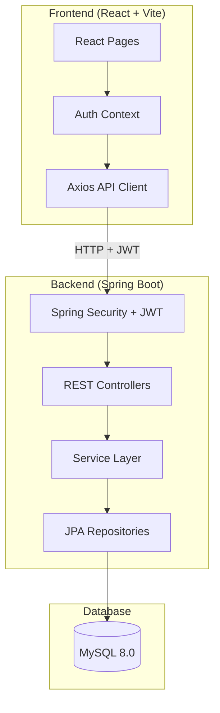
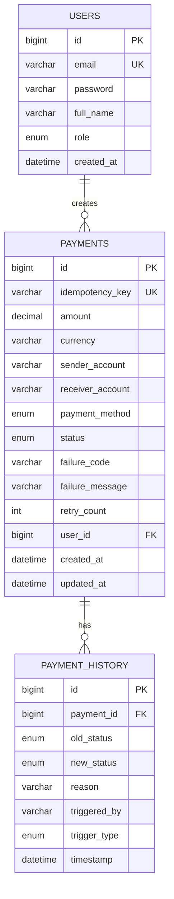
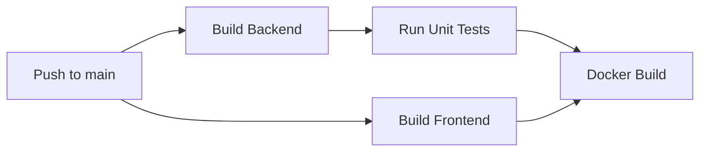

# 🏛️ Architecture & System Design

## Overview
FlowPay is built using a modern, scalable architecture splitting the frontend and backend into distinct layers, communicating via RESTful APIs.

---

## 🗄️ Database Schema

The database relies on MySQL 8.0 with JPA/Hibernate managing the entities.

---

## 🚀 CI Pipeline

Automated checks and deployments via GitHub Actions.

