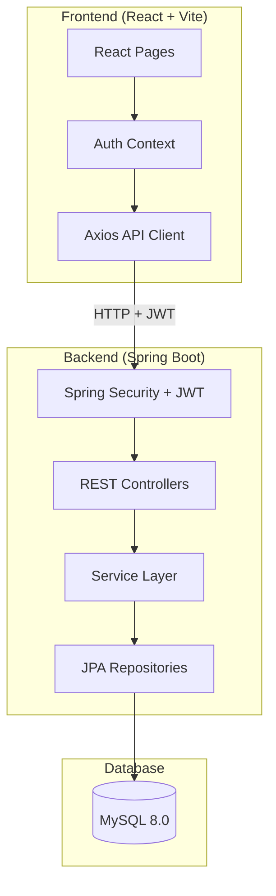
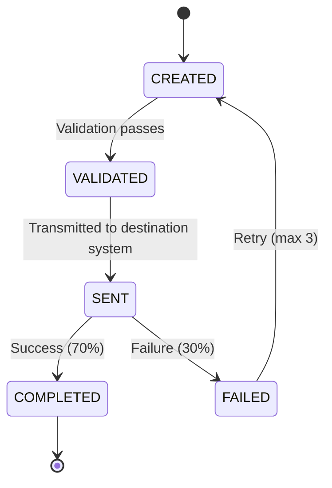
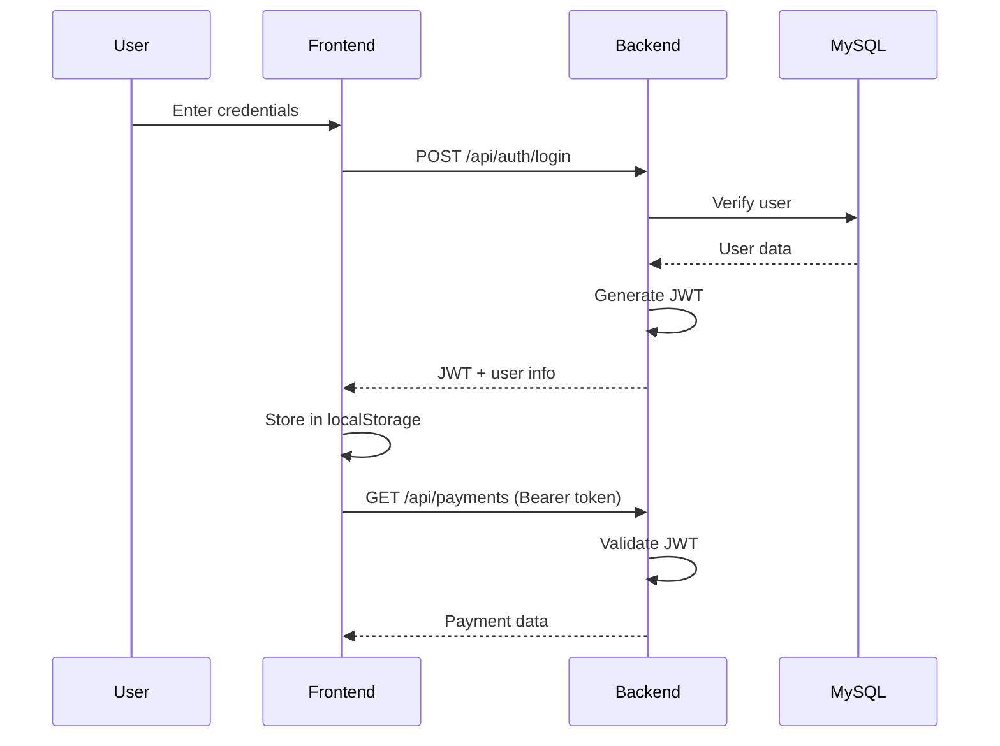
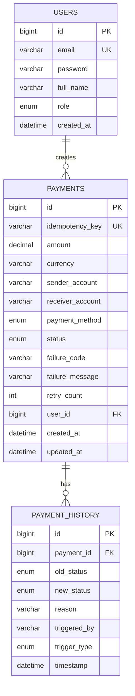
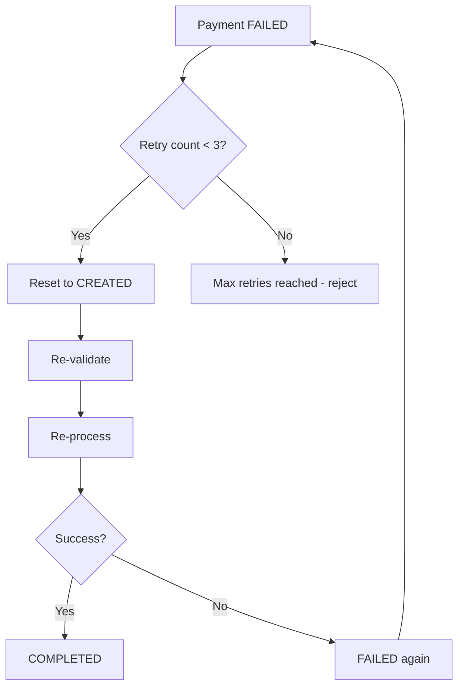
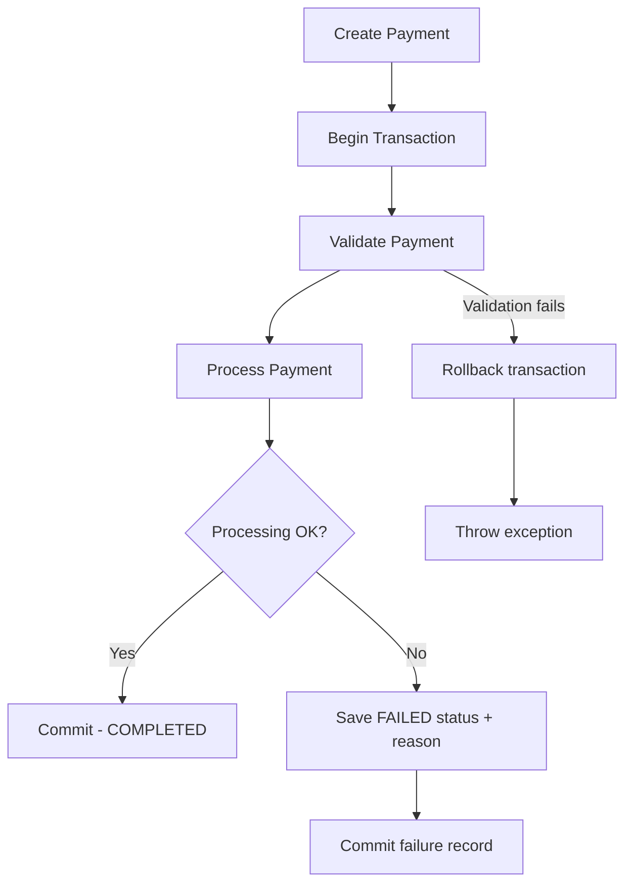
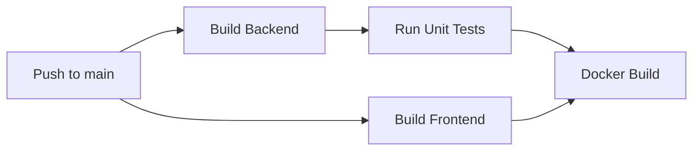

# FlowPay 💸

A full-stack payment processing system built as a 5-day Agile Sprint project by a team of 3 junior software engineers.


---

## 📋 Features

- **User Authentication** — JWT login with single-user mode (only one account can be registered)
- **Payment CRUD** — Create, read, list, and search payments
- **Payment Lifecycle** — CREATED → VALIDATED → SENT → COMPLETED/FAILED
- **Multiple Payment Methods** — CARD, BANK_TRANSFER, UPI with method-specific validation
- **Idempotency** — Duplicate payment detection via idempotency keys
- **Retry Mechanism** — Retry failed payments (max 3 attempts)
- **Audit Trail** — Full history of every status change with timestamps, trigger type, and trigger actor
- **Transaction Rollback** — Spring `@Transactional` for data consistency
- **API Documentation** — Swagger/OpenAPI at `/swagger-ui.html`
- **Dockerized** — One command to run everything
- **CI Pipeline** — GitHub Actions (build, test, docker)

---

## 🏗️ Tech Stack

| Layer | Technology |
|-------|-----------|
| Backend | Spring Boot 3.3, Java 21, Spring Data JPA, Spring Security |
| Frontend | React 18, Vite, Axios, React Router, Tailwind CSS |
| Database | MySQL 8.0 |
| Auth | JWT (JJWT), BCrypt |
| Docs | Swagger / OpenAPI 3 |
| Testing | JUnit 5, Mockito |
| DevOps | Docker, Docker Compose, GitHub Actions |

---

## 🏛️ Architecture



---

## 🔄 Payment Lifecycle



---

## 🔐 Authentication Flow



---

## 🗄️ Database Schema



---

## 🔁 Retry Flow



---

## 🔄 Rollback Flow



---

## 🚀 CI Pipeline



---

## 🚀 Quick Start

### Prerequisites

- [Docker Desktop](https://www.docker.com/products/docker-desktop/) installed and running

### Run everything (one command)

```bash
git clone https://github.com/your-team/flowpay.git
cd flowpay
docker compose up --build
```

That's it! Open:
- **Frontend**: http://localhost:3000
- **Backend API**: http://localhost:8080/api
- **Swagger UI**: http://localhost:3000/swagger-ui/index.html

### Stop

```bash
docker compose down
```

### Reset database

```bash
docker compose down -v
docker compose up --build
```

---

## 🧪 Running Tests

```bash
cd backend
./mvnw test
```

---

## 📖 API Documentation

### Auth Endpoints

| Method | URL | Auth | Description |
|--------|-----|------|-------------|
| POST | `/api/auth/register` | No | Register first and only user |
| POST | `/api/auth/login` | No | Login, get JWT |

#### Register

```bash
curl -X POST http://localhost:8080/api/auth/register \
  -H "Content-Type: application/json" \
  -d '{
    "fullName": "John Doe",
    "email": "john@example.com",
    "password": "password123"
  }'
```

**Response (201):**
```json
{
  "success": true,
  "message": "User registered successfully",
  "data": {
    "token": "eyJhbGciOi...",
    "email": "john@example.com",
    "fullName": "John Doe",
    "role": "USER"
  },
  "timestamp": "2026-07-30T10:00:00"
}
```

#### Login

```bash
curl -X POST http://localhost:8080/api/auth/login \
  -H "Content-Type: application/json" \
  -d '{
    "email": "john@example.com",
    "password": "password123"
  }'
```

### Payment Endpoints

| Method | URL | Auth | Description |
|--------|-----|------|-------------|
| POST | `/api/payments` | Yes | Create payment |
| GET | `/api/payments` | Yes | List all payments |
| GET | `/api/payments/{id}` | Yes | Get payment by ID |
| GET | `/api/payments/status/{status}` | Yes | Filter by status |
| GET | `/api/payments/{id}/history` | Yes | Get audit history |
| POST | `/api/payments/{id}/retry` | Yes | Retry failed payment |

#### Create Payment

```bash
curl -X POST http://localhost:8080/api/payments \
  -H "Content-Type: application/json" \
  -H "Authorization: Bearer <token>" \
  -d '{
    "amount": 100.00,
    "currency": "USD",
    "senderAccount": "1234567890",
    "receiverAccount": "0987654321",
    "paymentMethod": "CARD",
    "idempotencyKey": "unique-key-001"
  }'
```

**Response (201):**
```json
{
  "success": true,
  "message": "Payment created",
  "data": {
    "id": 1,
    "idempotencyKey": "unique-key-001",
    "amount": 100.00,
    "currency": "USD",
    "senderAccount": "1234567890",
    "receiverAccount": "0987654321",
    "paymentMethod": "CARD",
    "status": "COMPLETED",
    "failureCode": null,
    "failureMessage": null,
    "retryCount": 0,
    "createdAt": "2026-07-30T10:00:00",
    "updatedAt": "2026-07-30T10:00:01"
  },
  "timestamp": "2026-07-30T10:00:01"
}
```

#### Error Codes

All error responses now include a machine-readable `errorCode` field.

| Error Code | HTTP Status | Meaning |
|------------|-------------|---------|
| `INVALID_AMOUNT` | 400 | Amount is zero, negative, or invalid |
| `INVALID_ACCOUNT` | 400 | Account format invalid or sender=receiver |
| `INVALID_CURRENCY` | 400 | Currency code is not supported |
| `INVALID_STATUS_TRANSITION` | 400 | Payment transition is not allowed |
| `MAX_RETRY_EXCEEDED` | 400 | Failed payment exceeded retry limit |
| `SINGLE_USER_MODE` | 400 | Registration blocked after first account |
| `AUTHENTICATION_FAILED` | 401 | Invalid credentials or token |
| `PAYMENT_NOT_FOUND` | 404 | Payment ID does not exist |
| `DUPLICATE_RESOURCE` | 409 | Duplicate registration/email |
| `PROCESSING_ERROR` | 500 | Internal processing failure |
| `INTERNAL_SERVER_ERROR` | 500 | Unexpected server error |

Example error response:

```json
{
  "success": false,
  "message": "Invalid status transition: COMPLETED -> CREATED",
  "errorCode": "INVALID_STATUS_TRANSITION",
  "timestamp": "2026-07-31T12:15:10"
}
```

---

## 📁 Project Structure

```
FlowPay/
├── backend/
│   ├── src/main/java/com/flowpay/
│   │   ├── controller/       # REST endpoints
│   │   ├── service/          # Business logic
│   │   ├── repository/       # JPA repositories
│   │   ├── model/            # Entities & enums
│   │   ├── dto/              # Request/Response objects
│   │   ├── config/           # Security, Swagger, CORS
│   │   ├── security/         # JWT filter & utility
│   │   └── exception/        # Custom exceptions & handler
│   ├── src/test/             # Unit tests
│   ├── Dockerfile
│   └── pom.xml
├── frontend/
│   ├── src/
│   │   ├── api/              # Axios client & endpoints
│   │   ├── components/       # Navbar, ProtectedRoute
│   │   ├── context/          # AuthContext
│   │   └── pages/            # Login, Register, Dashboard, Payments
│   ├── Dockerfile
│   └── package.json
├── .env                      # Environment config (committed for portability)
├── .github/workflows/ci.yml  # CI pipeline
├── docker-compose.yml        # One-command startup
└── README.md
```

---

## 👥 Team & Contributions

| Member | Role | Commits |
|--------|------|---------|
| **Member A** | Backend setup, Auth, Security | 5 commits |
| **Member B** | Payment APIs, Business Logic, Tests | 6 commits |
| **Member C** | Frontend, Docker, CI/CD, Docs | 6 commits |

### Git History

```
feat: init Spring Boot project with MySQL (Member A)
feat: add JWT auth + BCrypt password encoder (Member A)
feat: configure Spring Security, role-based access (Member A)
feat: user registration & login REST APIs (Member A)
fix: auth token expiration bug (Member A)
feat: create Payment entity, enums & JPA repo (Member B)
feat: payment CRUD endpoints + validation (Member B)
feat: simulate processing, random success/failure (Member B)
feat: retry endpoint + max-3 logic, rollback handling (Member B)
feat: audit-trail entity + history tracking (Member B)
test: service layer unit tests (~65% coverage) (Member B)
feat: scaffold React + Vite + Tailwind (Member C)
feat: login/register UI + auth context (Member C)
feat: dashboard, create-payment form, list page (Member C)
chore: Dockerfiles + docker-compose.yml (Member C)
ci: GitHub Actions workflow (build, test, docker) (Member C)
docs: README, mermaid diagrams, API tables (Member C)
```

---

## 🔮 Future Improvements

- [ ] Email notifications on payment status change
- [ ] Admin dashboard with analytics
- [ ] Payment search by date range
- [ ] Export payments to CSV
- [ ] Pagination for payment list
- [ ] Real payment gateway integration (Stripe/Razorpay)
- [ ] Password reset flow
- [ ] Rate limiting on API endpoints

---

## 📄 License

This project was built for educational purposes as part of a Software Engineering sprint exercise.
