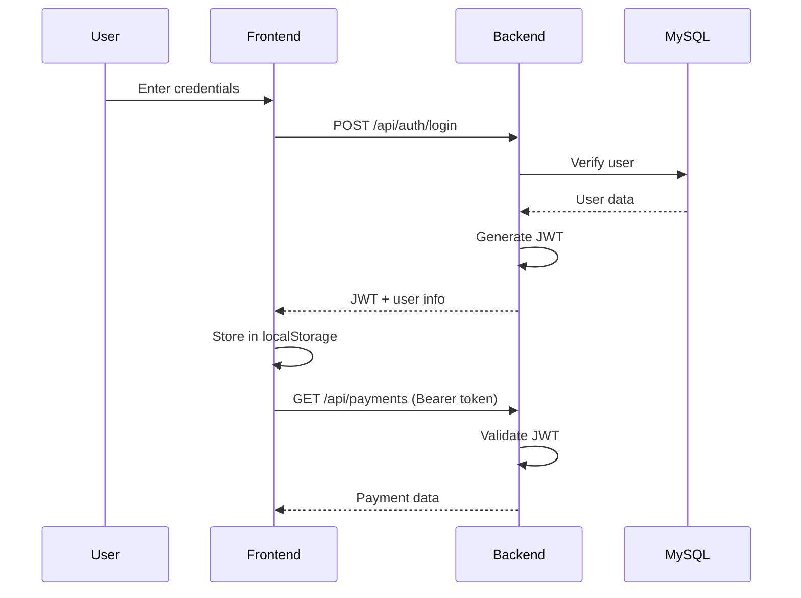
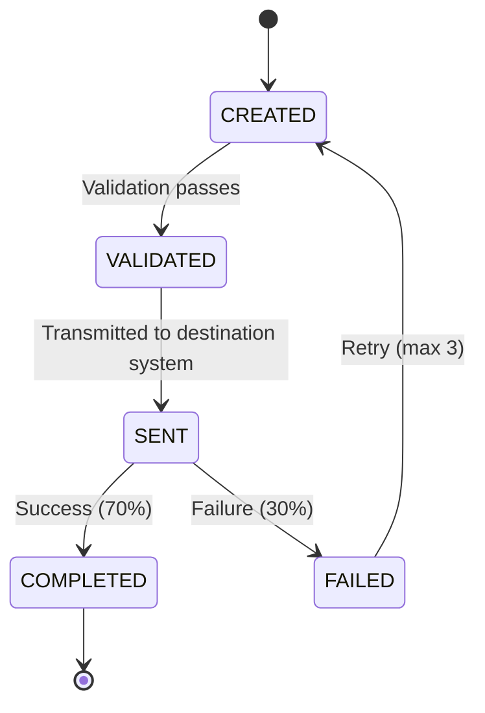
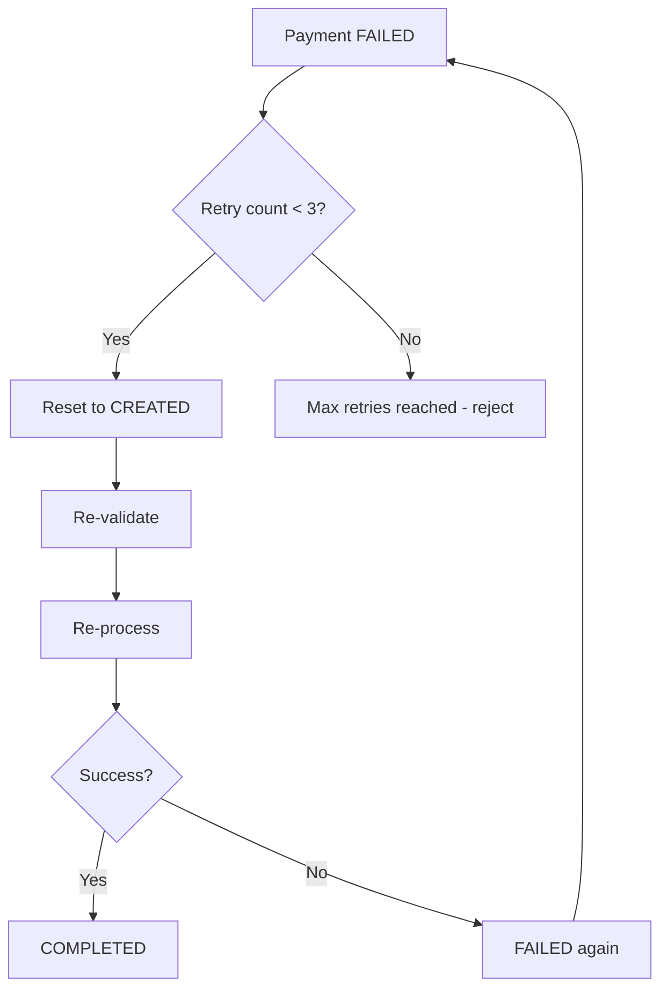
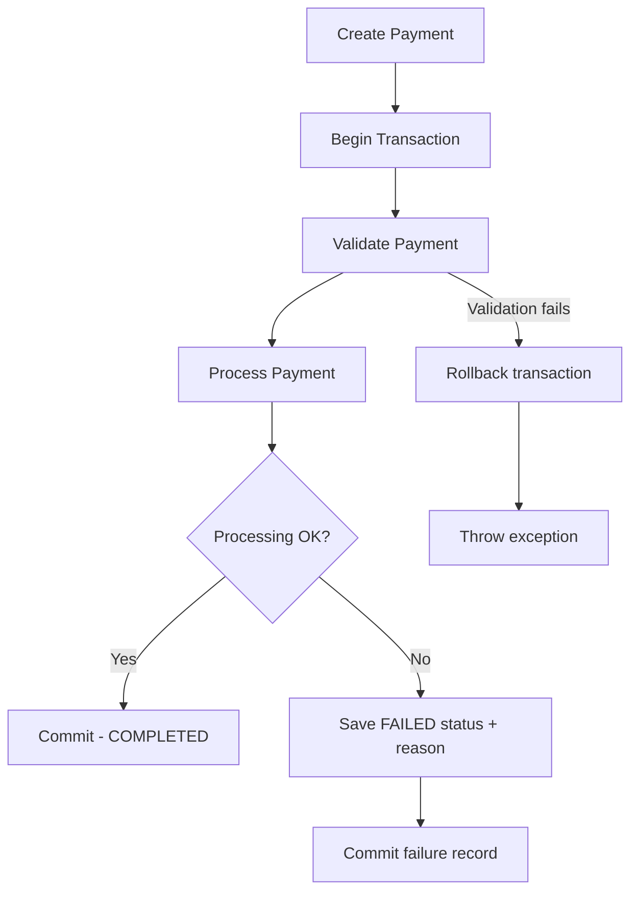

# 🔄 Workflows & State Machines

This document outlines the core business logic, lifecycle states, and security flows in PayFlow.

## 🔐 Authentication Flow

Stateless JWT authentication handles all secure access.

---

## 🔄 Payment Lifecycle

A strict state machine governs all payments.

---

## 🔁 Retry Flow

Handling transient failures with a capped retry mechanism.

---

## 🔄 Rollback Flow

Ensuring data consistency via Spring `@Transactional`.

